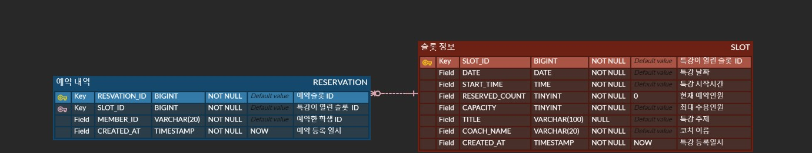

# ERD

## 요구사항 정리

- 특강 특정 날짜와 특정시간에 진행된다.
- 특강을 하는 강연자가 누군지 알 수 있어야 한다.
- 사용자는 특강을 선택하여 예약할 수 있다.
- 사용자 ID로 예약한 특강을 조회할 수 있다.
- 예약 가능한 특강을 조회할 수 있다.
- 신청 완료된 특강을 조회할 수 있다.

## 핵심 엔티티

1. 예약을 할 수 있는 슬롯(특강)
2. 예약 내역

## ERD

### 슬롯 - 예약의 관계 == 슬롯 1 : N 예약
하나의 특강 슬롯에 여러명의 예약내역이 존재할 수 있으며, 없을 수도 있다.

### 선택성

슬롯 정보는 **필수** : 예약 내역이 있으려면 특강 슬롯 정보가 필수적으로 있어야 한다.
예약 내역은 **선택** : 예약 내역이 없더라도 특강 슬롯 정보는 존재할 수 있다.

## 요구사항과 관련된 속성 설명

- 특강 특정 날짜와 특정시간에 진행된다.
  - SLOT 테이블의 DATE컬럼과 START_TIME 컬럼으로 관리
- 특강을 하는 강연자가 누군지 알 수 있어야 한다.
  - SLOT 테이블의 COACH_NAME 컬럼으로 관리
- 사용자는 특강을 선택하여 예약할 수 있다.
  - RESERVATION 테이블에서 SLOT_ID 와 MEMBER_ID 로 관리
- 사용자 ID로 예약한 특강을 조회할 수 있다.
  - RESERVATION 테이블의 MEMBER_ID로 조회하며, SLOT_ID로 SLOT테이블과 조인
- 예약 가능한 특강을 조회할 수 있다.
  - SLOT 테이블의 CAPACITY 와 RESERVED_COUNT 로 관리
- 신청 완료된 특강을 조회할 수 있다.
  - SLOT 테이블의 CAPACITY 와 RESERVED_COUNT 로 관리

## 확장성

- 추후 사용자나 강연자에 대한 정보를 추가하여 관리할 경우
  - MEMBER 테이블을 추가하여 RESERVATION 테이블의 MEMBER_ID과 관계를 맺어 해결 가능
  - COACH 테이블을 추가하여 SLOT 테이블과 관계를 맺어 해결 가능
